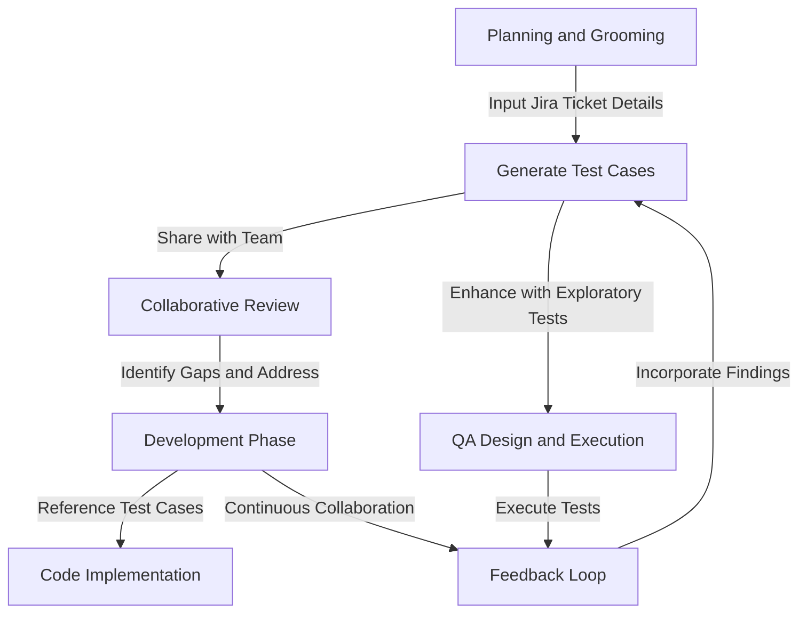

### Benefits and Recommended Usage of the AQEA

#### **Benefits**

1. **Improved Requirement Clarity**:
   - By generating test cases directly from feature requirements, the tool helps development teams better understand what is expected. This reduces ambiguities and ensures everyone is aligned on the scope.

2. **Early QA Involvement**:
   - Encourages QA participation from the very beginning of the sprint cycle, during planning and grooming sessions. QA can validate requirements and acceptance criteria while test cases are generated, ensuring a thorough review.

3. **Time-Saving**:
   - Automates the creation of detailed, structured test cases, saving significant time during planning, grooming, and test design phases. The reduction in back-and-forth discussions leads to higher efficiency.

4. **Enhanced Collaboration**:
   - Serves as a collaborative tool for cross-functional teams. Developers, QA engineers, and product owners can use the generated test cases to discuss potential edge cases, integration points, and performance criteria.

5. **Standardized Test Cases**:
   - Ensures uniformity in test case formats, making it easier to integrate with automation frameworks and maintain consistency across teams.

6. **Focus on Quality**:
   - Helps QA teams focus on exploratory and edge-case testing by automating routine test case creation, ultimately enhancing the quality of the final product.

7. **Integration-Ready**:
   - Designed for future integration with tools like Jira and test management systems, allowing seamless workflows.

---

#### **Recommended Workflow for Using the Tool**

1. **Planning and Grooming**:
   - During sprint planning or backlog grooming, QA should bring the Jira Test Case Generator into the discussion.
   - Input the Jira ticket details (including user stories, technical specifications, and acceptance criteria) into the tool.
   - Use the generated test cases to validate the completeness of requirements. Identify gaps or unclear criteria and address them in real time.

2. **Collaboration**:
   - Share the generated test cases with the development and product teams.
   - Review edge cases, integration points, and scenarios as a group. This collaborative review ensures all perspectives are considered early on.

3. **Development Phase**:
   - Developers can reference the generated test cases to guide their implementation. By understanding the QA’s perspective, they can write code that meets both functional and non-functional requirements.

4. **QA Design and Execution**:
   - QA teams can enhance the generated test cases with additional exploratory tests, focusing on less predictable scenarios.
   - Test cases can be executed manually or fed into automation pipelines, leveraging their detailed structure for efficient testing.

5. **Feedback Loop**:
   - Post-execution, any new findings or improvements to test coverage can be incorporated into the tool’s workflow or templates, continuously enhancing its effectiveness.

## Workflow Diagram

### Explanation:
- **Nodes** represent the key steps in the workflow.
- **Arrows** show the sequence of activities and how they feed into each other.
- The loop between execution and feedback highlights the iterative nature of Agile practices.

#### **Alignment with Agile Practices**

1. **QA in the Definition of Done**:
   - The tool supports Agile principles by ensuring QA is embedded in every stage of the sprint. Test case creation becomes part of the Definition of Ready and Definition of Done.

2. **Continuous Collaboration**:
   - Facilitates ongoing communication between QA, developers, and product owners, reducing silos and ensuring shared accountability for quality.

3. **Iterative Improvement**:
   - As the tool evolves, its ability to generate increasingly sophisticated test cases will complement the iterative nature of Agile development, helping teams adapt to changing requirements.

4. **Reducing Rework**:
   - By addressing potential issues during planning and grooming, the tool minimizes the need for rework, saving time and resources across the sprint.

---

By embedding this tool into Agile workflows, organizations can enhance their QA processes, foster collaboration, and deliver high-quality products with fewer delays and inefficiencies.